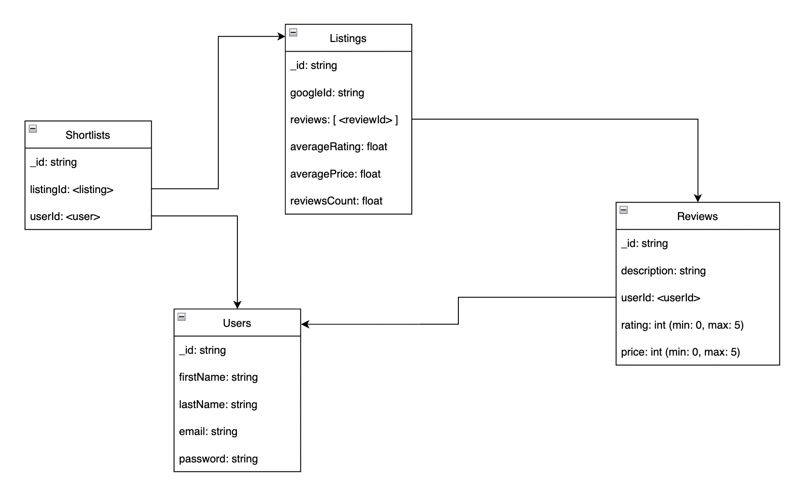
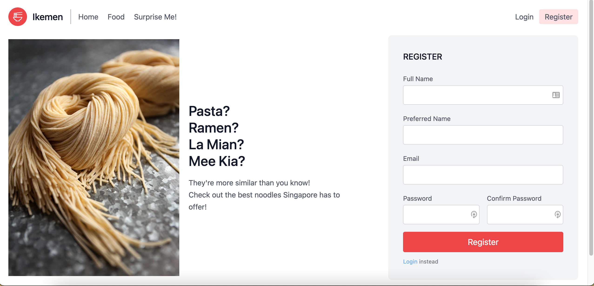
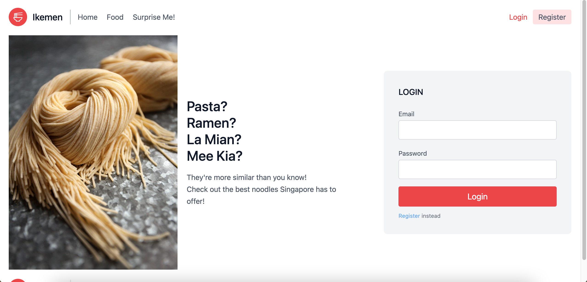
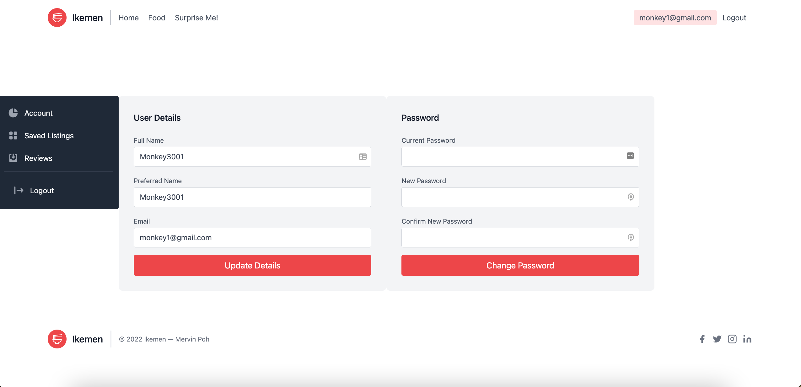
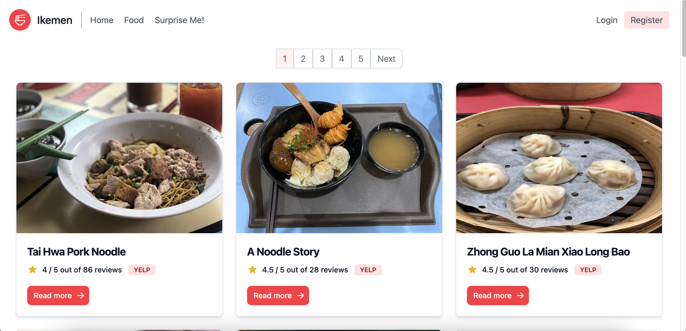
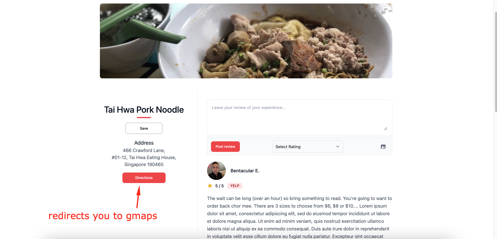
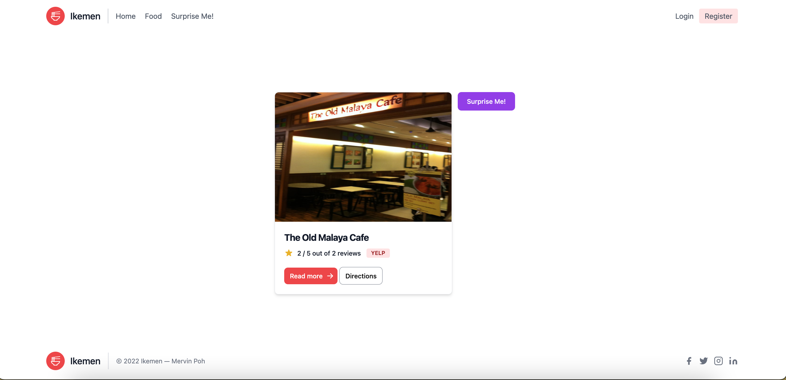

# Ikemen
___
A site that recommends famous Noodle Dishes/Stalls around Singapore based on Yelp Reviews.

Idea for this app was inspired by my wife who is not Singaporean. And didn't know that local Singapore food has similarities with the food of her homeland. So this site tries to introduce something similar that is present in many cultures - noodles!
___
Ikemen is a play on a Japanese word
- Ikemen = Handsome Man
- Ike = colloquially means "go"
- Men = colloquially means "noodle"

Weblink: https://ga-project2-ikemen.herokuapp.com/

## Introduction

The aim of this project was to incorporate as much of what I've learnt during Unit 2 of my General Assembly (GA) Software Engineering Immersive Flex (SEIF) program.

## Things I've included to practise

- API Calls
- MVC file structure _(#itried)_
- Data Validation before pushing it to the DB
- Routes
- Partials
- Data Schemas
- DB document references
- Creating a smooth user journey
- Ability for user to change passwords
- Ability for user to update account details

## Technologies

- Node.js
- Express.js
- Tailwind CSS
- Flowbite (works as a skin on top of Tailwind)
- Joi Validation
- MongoDB
- Mongoose
- Heroku (to host site)

## Illustrations

DB Schema

Registration Page

Login Page

User Account Page

Food Listing Page

Individual Listing Page

Surprise Me! Page

## Learning Challenges
- Able to validate data before creating/updating them on the DB
- Able to let the user "save" a listing direct from the listing page
- Able to let the user delete his/her review direct from the listing page
- Utilizing Tailwind CSS for the first time and using the compenents that meet my needs

## Points to Improve
- Choosing better variable names
- Slow down and think of the process before coding.
- Streamline code
- Implement "Forgot Password" Feature
- Implement photo uploading for Profile Picture and Food Reviews
- Finish the Accounts Page to display "Saved Listings" and "User Reviews"
- Make the site fully mobile responsive
